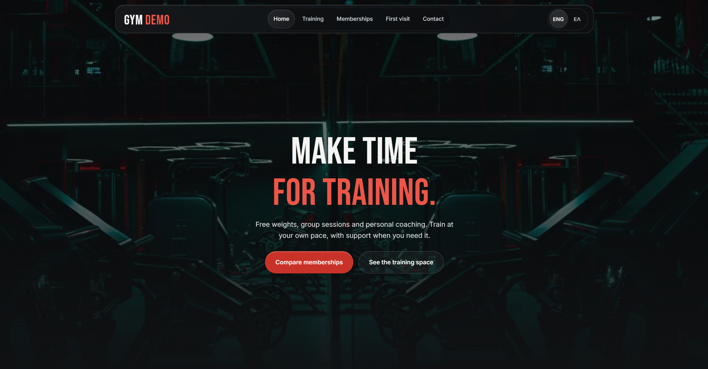

# Gym Website Demo

A responsive website for a fictional gym, with complete English and Greek interfaces. Visitors can explore the training space, browse a weekly class schedule, compare memberships and plan a first visit.

**[View the live demo →](https://gym-demo-8es.pages.dev/)**

## About the project

This project demonstrates a complete gym website experience across mobile, tablet and desktop. It brings together the information a prospective member needs, from available classes and membership options to common questions and contact details.

## Features

- **English and Greek:** language switching with translated interface copy.
- **Weekly class schedule:** browse the gym's timetable.
- **Membership options:** compare plans and carry a membership choice into the contact flow.
- **Contact form:** client-side validation and clear feedback.
- **Responsive layouts:** navigation and page layouts adapted to different screen sizes.
- **Supporting pages:** member stories, frequently asked questions and a dedicated 404 page.

## Technology

| Area | Tools |
| --- | --- |
| Interface | React 19, TypeScript |
| Build | Vite 7, static page rendering |
| Routing | React Router |
| Styling | Tailwind CSS 3, custom CSS |
| Form selection | Radix UI Select |
| Typography | Self-hosted Inter and Bebas Neue |
| Hosting | Cloudflare Pages |

## Quality checks

The published demo was checked for responsive layout, horizontal overflow, page navigation and English/Greek behavior. Automated accessibility checks and browser interaction checks covered the main pages, forms, class calendar and 404 experience.

The build also validates translation pairs and TypeScript. Static pages and compressed assets support efficient delivery, and fonts are self-hosted.

## Demo scope

This is a frontend portfolio project for a fictional business. The contact form demonstrates validation; it does not send messages. No bookings or payments are processed. The business and location details are fictional.

The live demo intentionally asks search engines not to index it.

## Source code

This repository is a public project showcase. Application source code is not included.

## Author

[Joni Finskas](https://github.com/JoniFinskas)

Copyright © 2026 Joni Finskas. All rights reserved. Third-party assets retain their respective licenses. This showcase does not grant a license to reuse the website or its assets.

